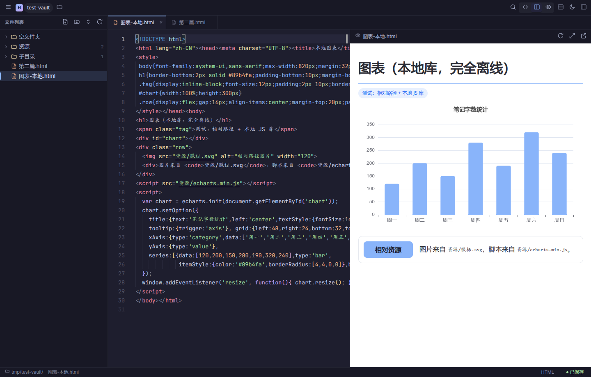

# Hypernote

**用 HTML 写笔记。** 一个基于文件夹的笔记管理器 —— 每篇笔记就是你磁盘上一个真实的
`.html` 文件，可以用完整的 HTML、CSS 和 JavaScript。

因为笔记就是网页，所以图表、动画、交互组件全都能用。预览用的是真实浏览器内核，
编辑和预览互相独立：可以只编辑、只预览、左右分屏、上下分屏，或者把预览弹到独立窗口。

> English: Hypernote is a folder-based note manager where each note is a plain `.html`
> file on disk, so notes can use full HTML/CSS/JS — charts, animations and interactive
> widgets all work. The UI is currently Chinese; see [Roadmap](#路线图).



---

## 为什么是 HTML 笔记

Markdown 很好，但它有天花板。HTML 笔记能做的事：

| 场景 | Markdown | HTML 笔记 |
|------|----------|-----------|
| 写文字、列清单 | ✅ | ✅ |
| 交互式图表（ECharts / D3 / Plotly） | ❌ | ✅ |
| 用 CSS Grid/Flexbox 排版 | ❌ | ✅ |
| 嵌入可交互的小组件 | ❌ | ✅ |
| 内置动画、计算 | ❌ | ✅ |

而且没有锁定：笔记是普通文件，用任何编辑器都能打开，用浏览器就能看，删掉这个程序
笔记照样在。

---

## 安装

### 下载安装包

从 [Releases](https://github.com/justliulong/Hypernote/releases) 下载：

| 格式 | 适用 | 装法 |
|------|------|------|
| **AppImage** | 任何 Linux | `chmod +x Hypernote-1.0.0-x86_64.AppImage && ./Hypernote-1.0.0-x86_64.AppImage` |
| **deb** | Debian / Ubuntu | `sudo dpkg -i Hypernote-1.0.0-amd64.deb` |
| **pacman** | Arch / Manjaro / EndeavourOS | `sudo pacman -U Hypernote-1.0.0-x64.pacman` |

> **Arch 用户**：AUR 包（`hypernote-bin`）已准备好，但 AUR 目前**暂停了新账号注册**
> （全站措施，应对自动化垃圾注册），所以还没发布上去。发布之后就可以用
> `yay -S hypernote-bin` 安装并跟随系统更新。在那之前请用上面的 pacman 包。
> 包定义在 [`packaging/aur/`](packaging/aur/)，维护说明见那里的 README。

### 从源码运行

```bash
git clone https://github.com/justliulong/Hypernote.git && cd Hypernote
npm install

./start.sh          # Linux / macOS
start.bat           # Windows
```

`start.sh` 会自动找 electron：优先项目里的 `node_modules`，其次系统装的 `electron` 或
`electronXX`。

**想从应用菜单启动**（不用打包）：

```bash
./install-desktop.sh              # 装进应用菜单，带图标
./install-desktop.sh --uninstall  # 移除
```

---

## 用法

### 四种编辑/预览组合

标题栏中间的分段控件切换：

| 模式 | 说明 |
|------|------|
| **仅编辑** | 编辑器占满界面，写代码时视野最大 |
| **分屏** | 编辑与预览并排，拖中间的分隔条调比例 |
| **仅预览** | 预览占满界面，适合看成品效果 |

分屏方向可以**左右**或**上下**（点标题栏的 ⬓ 按钮切换）。布局会被记住，下次打开还是原样。

**独立预览窗口**：点预览栏的 ⤢ 按钮，预览弹成独立窗口，主窗口自动切回「仅编辑」。
适合一边全屏写、一边在副屏看效果。

### 文件管理

- 新建笔记 / 文件夹（根目录，或在任意文件夹上右键）
- 重命名：文件树上按 `F2`（内联编辑，自动选中主文件名）
- 删除：非空文件夹会二次确认
- 拖拽移动：把文件拖到文件夹上，或拖到文件的上/下半区
- 复制副本、在文件管理器中显示、复制路径
- **空文件夹也会显示**，不会被隐藏

### 其他

- 多标签，每个标签保留自己的撤销历史和光标位置
- 全文搜索，高亮匹配，显示每个文件的命中次数
- 命令面板（`Ctrl+P`），模糊匹配所有操作
- 暗色 / 浅色 / 跟随系统主题
- 脏状态精确：撤销回到保存点时，自动变回「已保存」
- 检测外部改动：文件被别的程序改了会自动重载；你本地有未保存改动时会提示而不是覆盖
- 关闭窗口前拦截未保存内容

---

## 键盘快捷键

| 快捷键 | 操作 |
|--------|------|
| `Ctrl+O` | 打开笔记文件夹 |
| `Ctrl+N` | 新建笔记 |
| `Ctrl+Shift+N` | 新建文件夹 |
| `Ctrl+S` / `Ctrl+Alt+S` | 保存 / 全部保存 |
| `Ctrl+W` | 关闭当前标签 |
| `Ctrl+Tab` | 下一个标签 |
| `Ctrl+P` | 命令面板 |
| `Ctrl+Shift+F` | 全文搜索 |
| `Ctrl+E` | 在三种布局间轮换 |
| `Ctrl+B` | 显示 / 隐藏侧边栏 |
| `Ctrl+,` | 设置 |
| `Alt+Shift+F` | 格式化文档 |
| `F2` / `Delete` | 重命名 / 删除（文件树上） |
| `F5` | 刷新文件列表 |
| `↑` `↓` `←` `→` `Enter` | 文件树导航 |

---

## 预览是怎么工作的

这一节解释了为什么这里的预览比"把 HTML 塞进 iframe"强。

预览不是 `iframe srcdoc`，也不是 blob URL —— 那些方案会让相对路径和外部 CDN 全部失效，
而且预览的是保存后的内容而不是你正在写的内容。

Hypernote 在主进程注册了一个自定义协议：

```
notes://vault/<笔记在库内的相对路径>
```

于是预览页是一个**真正可浏览的文档**，因此：

- 外部 CDN 脚本正常加载（ECharts / D3 / Mermaid / Chart.js…）
- 相对路径的图片、CSS、子页面正常加载
- 预览的是编辑器里的**实时内容**，不必先保存
- 笔记里点内部 `.html` 链接 → 在编辑器里打开成标签页
- 笔记里点外部链接 → 走系统浏览器

### 推荐：把库放在笔记库里

虽然 CDN 能用，但**把用到的库下载到笔记库、用相对路径引用**更稳：

```html
<script src="资源/echarts.min.js"></script>
```

这样笔记不依赖外部服务，换台机器、断网都能看。

---

## 疑难排查

### 笔记里的图表不显示，控制台报 `echarts is not defined`

预览是一个独立的浏览器页面，**它需要能访问外网**才能下载 CDN 上的库。

程序检测到这种情况会弹提示，点「查看原因」能看到具体是什么挡住的。常见的两种：

**系统代理配着但没运行。** Chromium 会读桌面环境的代理设置，而 `curl` 只读
`http_proxy` 环境变量 —— 所以「curl 能通但程序不通」通常就是这个原因。

```bash
gsettings get org.gnome.system.proxy mode     # GNOME
grep ProxyType ~/.config/kioslaverc           # KDE
```

代理没在跑就去系统设置里关掉。

**DNS 不可达。** Chromium 用自己的解析器直接读 `/etc/resolv.conf`：

```bash
dig @$(grep -m1 nameserver /etc/resolv.conf | awk '{print $2}') example.com
```

超时就说明那台 DNS 不通。

### 应用起不来，或报 `Cannot find module 'electron'`

你的环境里可能被注入了 `ELECTRON_RUN_AS_NODE=1`（VS Code 及其扩展宿主、部分
Electron 系工具链会这么干）。它会让 electron 退化成纯 Node 进程 —— 没有窗口，
`require('electron')` 直接失败。

`start.sh` / `start.bat` 已经处理了。手动跑的话：

```bash
env -u ELECTRON_RUN_AS_NODE -u ELECTRON_NO_ATTACH_CONSOLE electron .
```

---

## 路线图

按优先级大致排序，欢迎提 issue 讨论：

- [ ] **Markdown 支持** —— 让 `.md` 文件也能打开和预览。编辑器侧 Monaco 原生支持
      markdown 语法高亮，主要工作在预览渲染（需要一个 md → html 的转换）。
      目标不是取代 Markdown 编辑器，而是让同一堆笔记里 HTML 和 MD 能共存、互相链接。
- [ ] **界面多语言** —— 目前只有中文。抽出文案层后加英文，才能面向非中文用户。
- [ ] **插件机制** —— 目前**没有**扩展点。需要先设计：插件能做什么（新的预览渲染器？
      自定义命令？侧栏面板？）、怎么隔离（独立进程 / 沙箱）、怎么分发。这块最容易失控，
      想清楚再动手比先写个 API 更重要。
- [ ] 文件树内手动排序 / 置顶
- [ ] 笔记内反向链接（谁引用了这篇）

---

## 开发

技术栈：**Electron** + **Monaco Editor**（VS Code 的编辑器内核）+ 原生 Node `fs`。
没有构建步骤 —— 前端是普通 `<script>` 加载的原生 JS，改完刷新即可。

```
hypernote/
├── main.js                 主进程：窗口 / notes:// 协议 / 文件系统 / 文件监听
├── preload.js              安全桥接层（contextBridge，渲染进程拿不到 Node）
├── src/
│   ├── index.html          主界面
│   ├── preview.html        独立预览窗口
│   ├── css/theme.css       设计令牌（暗色 / 浅色两套变量）
│   ├── css/style.css       布局与组件
│   └── js/
│       ├── util.js         工具函数、路径处理
│       ├── icons.js        内联 SVG 图标集
│       ├── ui.js           Toast / 菜单 / 模态 / 命令面板 / 主题
│       ├── editor.js       Monaco 封装（多 model、主题、快捷键）
│       ├── preview.js      预览面板
│       ├── preview-window.js  独立预览窗口
│       ├── fileTree.js     文件树（渲染 / 拖拽 / 右键 / 内联重命名）
│       ├── search.js       全文搜索
│       ├── tabs.js         多标签
│       └── app.js          主控制器
└── build/                  图标等打包资源
```

### 调试开关

```bash
# 打开 DevTools（同时把渲染进程 console 转发到终端）
./start.sh --dev

# 直接打开某篇笔记
./start.sh ~/笔记/某篇.html

# 无头截图（改 UI 时很有用）
electron . 笔记.html --wait 3000 --exec "App.setMode('preview')" --screenshot /tmp/a.png
```

### 打包安装包

见 [BUILD.md](BUILD.md)。

---

## 许可

MIT
